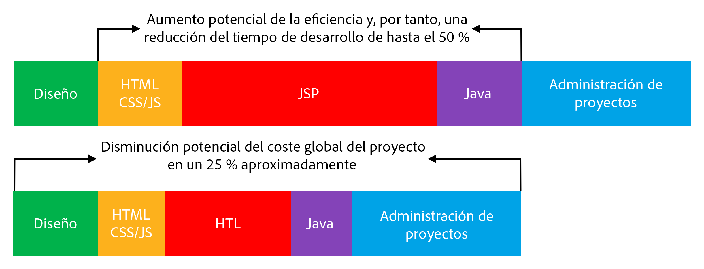

# Información general {#overview}

El propósito del lenguaje de plantilla HTML (HTL), admitido por Adobe Experience Manager (AEM), es ofrecer un marco web de nivel empresarial altamente productivo que aumenta la seguridad y permite que los programadores HTML sin conocimientos Java participen mejor en los proyectos de AEM.

El lenguaje de plantilla HTML se ha introducido con AEM 6.0 y toma el lugar de JSP (javaserver Pages) como el sistema de plantilla de lado de servidor preferido y recomendado para HTML. Para los programadores web que necesiten crear sitios web empresariales sólidos, el lenguaje de plantilla HTML ayuda a mejorar la seguridad y la eficiencia de desarrollo.

## Mayor seguridad {#increased-security}

El lenguaje de plantilla HTML aumenta la seguridad de los sitios que lo utilizan en su implementación, en comparación con JSP y con la mayoría de los demás sistemas de plantillas, porque HTL puede aplicar automáticamente el escape adecuado según el contexto a todas las variables que se presentan a la capa de presentación. HTL hace esto posible porque comprende la sintaxis HTML y utiliza ese conocimiento para ajustar la escapadora necesaria para expresiones, según su posición en la marca. Esto provocará, por ejemplo, que las expresiones colocadas en `href` o `src` atributos se muevan de forma distinta a las expresiones colocadas en otros atributos o en cualquier otra parte.

Aunque se puede conseguir el mismo resultado con los lenguajes de plantilla como JSP, el programador debe garantizar de forma manual que se aplique la escapadora adecuada a cada variable. Como una sola omisión o error en la escapadora aplicada es potencialmente suficiente para provocar una vulnerabilidad de secuencias de comandos entre sitios (XSS), decidimos automatizar esta tarea con HTL. Si es necesario, los desarrolladores pueden seguir especificando un escape diferente en las expresiones, pero con HTL es mucho más probable que se corresponda con el comportamiento deseado, reduciendo así la probabilidad de errores.

## Desarrollo simplificado {#simplified-development}

El lenguaje de plantilla HTML es fácil de aprender y sus funciones están limitadas a fin de garantizar que permanezcan simples y simples. También dispone de potentes mecanismos para estructurar la lógica de marcado e invocación, al mismo tiempo que aplica una estricta división de las preocupaciones entre la marca y la lógica. HTL es HTML 5 estándar porque usa expresiones y atributos de datos para anotar la marca con el comportamiento dinámico deseado, lo que significa que no interrumpe la validez del marcado y la mantiene legible. Tenga en cuenta que la evaluación de las expresiones y los atributos de datos se realiza completamente en el lado del servidor y no se verá en el lado del cliente, donde se puede utilizar cualquier marco JavaScript que desee sin interferir.

Estas capacidades permiten que los programadores HTML sin conocimientos Java y con pocos conocimientos específicos de productos puedan editar plantillas HTL, permitiéndoles formar parte del equipo de desarrollo y racionalizar la colaboración con los desarrolladores de Java de apilamiento completo. Y viceversa esto permite a los desarrolladores de Java centrarse en el código de back-end sin tener que preocuparse por HTML.

## Costos reducidos {#reduced-costs}

Mayor seguridad, desarrollo simplificado y colaboración de equipo mejorada, traduce para proyectos de AEM en un esfuerzo reducido, un tiempo de comercialización más rápido (TTM) y un menor coste total de propiedad (TCO).

En esencia, a partir de lo que se ha observado al volver a implementar el sitio Adobe.com con el lenguaje de plantilla HTML, el coste y la duración del proyecto podrían reducirse en un 25% aproximadamente.

El diagrama anterior muestra las siguientes mejoras en la eficiencia posibles por HTL:

* **HTML/CSS/JS:** Puesto que los desarrolladores HTML pueden editar directamente plantillas HTL, no es necesario implementar los diseños front-end por separado del proyecto AEM, pero se pueden implementar directamente en los componentes reales de AEM. Esto reduce las difíciles iteraciones con los desarrolladores Java de apilamiento completo.
* **JSP/HTL:** Dado que HTL no requiere ningún conocimiento Java y es derecho a escribir, todo desarrollador con conocimientos HTML tiene capacidad para editar las plantillas.
* **Java:** Gracias a la clara y sencilla utilización de la API de uso proporcionada por HTL, la interfaz con la lógica comercial se clarifica, lo que también beneficia al desarrollo de Java en general.

**Siguiente:**

* [Introducción al lenguaje de plantilla HTML](getting-started.md)

